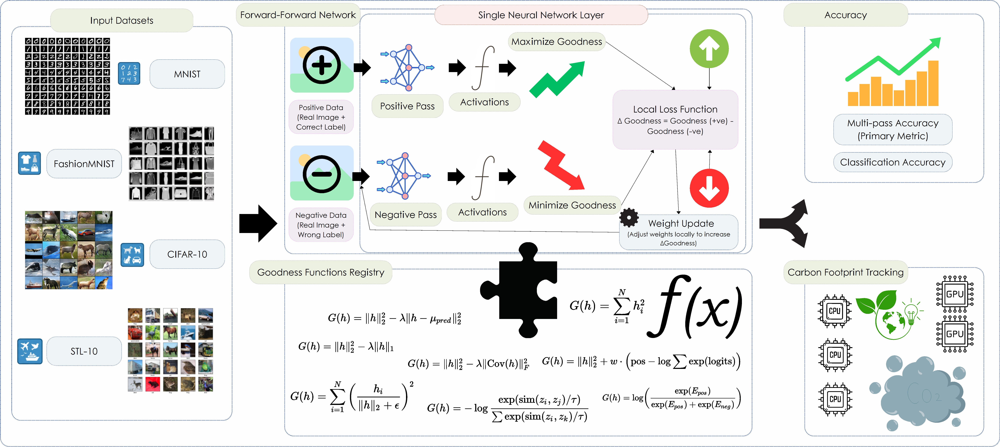

# In Search of Goodness: Large Scale Benchmarking of Goodness Functions for the Forward-Forward Algorithm


Authors: <a href="aryashah.me">Arya Shah</a> and <a href="https://iitgn.ac.in/faculty/cogs/fac-vaibhav"> Vaibhav Tripathi</a>

Arxiv Link: TBA

Paper Page: <a href="https://aryashah.me/In-Search-of-Goodness"In Search Of Goodness> Click Here</a>

If you use the code or research done in this repository, please CITE us!

> Citation to be added soon

-----------------

## Abstract

The Forward-Forward (FF) algorithm offers a biologically plausible alternative to backpropagation, enabling neural networks to learn through local updates. However, FF's efficacy relies heavily on the definition of "goodness", which is a scalar measure of neural activity. While current implementations predominantly utilize a simple sum-of-squares metric, it remains unclear if this default choice is optimal. To address this, we benchmarked 21 distinct goodness functions across four standard image datasets (MNIST, FashionMNIST, CIFAR-10, STL-10), evaluating classification accuracy, energy consumption, and carbon footprint. We found that certain alternative goodness functions inspired from various domains significantly outperform the standard baseline. Specifically, game_theoretic_local achieved 97.15% accuracy on MNIST, softmax_energy_margin_local reached 82.84% on FashionMNIST, and triplet_margin_local attained 37.69% on STL-10. Furthermore, we observed substantial variability in computational efficiency, highlighting a critical trade-off between predictive performance and environmental cost. These findings demonstrate that the goodness function is a pivotal hyperparameter in FF design.

Overview of the Forward-Forward algorithm and the diverse goodness functions evaluated in this study.



```text
Directory structure:
└── aryashah2k-in-search-of-goodness/
    ├── README.md
    ├── config.yaml
    ├── environment.yml
    ├── LICENSE
    ├── main.py
    ├── requirements.txt
    ├── run_goodness_benchmarks.py
    ├── goodness/
    │   ├── __init__.py
    │   ├── g_attention_weighted_local.py
    │   ├── g_bcm_local.py
    │   ├── g_decorrelation_local.py
    │   ├── g_fractal_dimension_local.py
    │   ├── g_game_theoretic_local.py
    │   ├── g_gaussian_energy_local.py
    │   ├── g_hebbian_local.py
    │   ├── g_huber_norm_local.py
    │   ├── g_info_nce_local.py
    │   ├── g_l2_normalized_energy_local.py
    │   ├── g_nt_xent_local.py
    │   ├── g_oja_local.py
    │   ├── g_outlier_trimmed_energy_local.py
    │   ├── g_pca_energy_local.py
    │   ├── g_predictive_coding_local.py
    │   ├── g_softmax_energy_margin_local.py
    │   ├── g_sparse_l1_local.py
    │   ├── g_sum_of_squares.py
    │   ├── g_tempered_energy_local.py
    │   ├── g_triplet_margin_local.py
    │   ├── g_whitened_energy_local.py
    │   └── registry.py
    └── src/
        ├── __init__.py
        ├── ff_mnist.py
        ├── ff_model.py
        └── utils.py
```

## Reproducibility

1. Create a Python Environment

```bash
python -m venv venv
```
2. Activate the env

```bash
source venv/bin/activate
```
3. Install the libraries

```bash
pip install -r requirements.txt
```
4. Run the benchmark script

```bash
pyton run_goodness_benchmarks.py
```

5. You can also run individual commands for specific goodness functions

```text
# For MNIST
python main.py input.dataset=mnist

# For FashionMNIST
python main.py input.dataset=fashionmnist

# For CIFAR-10
python main.py input.dataset=cifar10

# For STL-10
python main.py input.dataset=stl10

# Run with a specific goodness function:
python main.py input.dataset=mnist model.goodness_function=hebbian_local

# Run with different dataset and goodness function:
python main.py input.dataset=cifar10 model.goodness_function=info_nce_local
```

## How to Contribute

1. Fork The Repository
2. Make Changes (eg. Add new Goodness Functions)
3. Create a Pull Request
